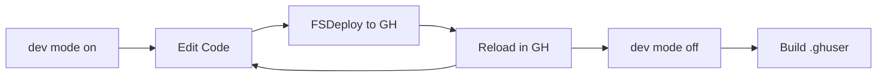

# DEVELOPMENT WORKFLOW

This guide summarizes the current workflow with regard to our Grasshopper Python-Component development and packaging. Note that *nothing* here is set in stone, but represents only our best effort so far to get control over our GHPython Components and make packaging as simple as we can for our specific use-cases. Your specific situation may not be the same as ours, and there are many other ways to organize python components and libraries. For a good summary of some of the different methods, check out the discussion on the [McNeel forum here.](https://discourse.mcneel.com/t/python-component-in-multiple-gh-files-how-to-keep-updated/174263/5)


## | Python Components in Grasshopper:


Honeybee-PH includes more than 120 Grasshopper Python components. With this many individual elements it is critical to have some automatic method of organization and packaging. Over time we have landed on a pattern which works well for our use case which allows us to develop locally within our preferred IDE (VSCode), deploy changes automatically (FSDeploy), and package the final elements together easily.


## | The Facade-Component Approach:
In order to improve overall maintainability and ease updates, all Honeybee-PH components follow a 'facade-component' pattern. This:
1. Allows us to work in our preferred IDE instead of in the GHPython component editor
1. Allows us to easily update the meaningful libraries without having to change the actual component objects in older Grasshopper files.

What is a facade-component in this case? All of our Grasshopper components are **only** responsible for the collection and organization of user-inputs and the passing along outputs. In this approach, all the **actual** work is done behind scenes by an associated worker-class. This approach means that the meaningful code in the [`honeybee-ph`](https://github.com/PH-Tools/honeybee_ph) or [`honeybee-ph-rhino`](https://github.com/PH-Tools/honeybee_grasshopper_ph/tree/main/honeybee_ph_rhino) libraries can be easily updated without requiring users to swap out or update any GHPython components within their actual Grasshopper definition files.

To take an example case, consider a simple component such as the [`HBPH-Ventilator`](https://github.com/PH-Tools/honeybee_grasshopper_ph/blob/main/honeybee_grasshopper_ph/src/HBPH%20-%20Ventilator.py) component which is used to create HRV/ERV equipment. The GHPython component code doesn't include much, and only looks like:


Stepping through what is happening in the component:
- - - 
First, since we keep all of the real 'worker' classes within the [`gh_comp_io`](https://github.com/PH-Tools/honeybee_grasshopper_ph/tree/main/honeybee_ph_rhino/gh_compo_io) package these classes get imported by the Grasshopper component, along with some utility classes:
```python
from honeybee_ph_rhino import gh_compo_io, gh_io
from honeybee_ph_utils import preview
```

- - - 
Next, the component is configured. The component nick-name and version information is set (`set_component_params()`) from the [`honeybee_ph_rhino._component_info_`](https://github.com/PH-Tools/honeybee_grasshopper_ph/blob/main/honeybee_ph_rhino/_component_info_.py) file to ensure that all components have consistent information in a consistent format. Notice that we also include a `dev` flag which is used during testing and development to allow for reloading the libraries without restarting Rhino. This allows for much more rapid development. This reloading can have some surprising side-effects however, and so for deployment this flag is turned 'off'
```python
import honeybee_ph_rhino._component_info_
reload(honeybee_ph_rhino._component_info_)
ghenv.Component.Name = "HBPH - Ventilator"

# Dev Flag to be set during development:
DEV = honeybee_ph_rhino._component_info_.set_component_params(ghenv, dev=False) 
if DEV:
    reload(gh_io)
    from honeybee_ph_rhino.gh_compo_io.hvac import create_ventilator as gh_compo_io
    # reload is great and lets you move faster. But has some weird effects sometimes. So we only use it during Dev
    reload(gh_compo_io)
```

- - - 
Now, the various user-inputs to the Grasshopper-component are all collected and handed off, without modification, to the worker class. In this case the [`GHCompo_CreatePhVentilator`](https://github.com/PH-Tools/honeybee_grasshopper_ph/blob/57177b929793a64dcb26bfadfe7b9440fd5d048b/honeybee_ph_rhino/gh_compo_io/hvac/create_ventilator.py#L23). *Note: by 'worker' I don't mean to say that it is a separate thread or process, just that its a class that does the 'work' as opposed to the facade script in Grasshopper...* Note here that we also hand off a standard 'Grasshopper-Interface' object (`IGH`) which is a wrapper around the basic Grasshopper packages (rhinoscriptsyntax, etc..) and objects (ghdoc, ghenv) that might be used by the component. These elements may be used during either the component work, or for use in displaying messages or warnings back to the user. Not all the Honeybee-PH components make use of these objects and classes, but we like to keep them available in all cases for standardization reasons and to improve flexibility. 
```python
# -- GH Interface
IGH = gh_io.IGH( ghdoc, ghenv, sc, rh, rs, ghc, gh )

# -- Hand off the component inputs to the actual worker class
gh_compo_interface = gh_compo_io.GHCompo_CreatePhVentilator(
        IGH,
        display_name_,
        sensible_hr_,
        latent_hr_,
        elec_efficiency_,
        frost_protection_,
        frost_temp_,
        inside_,
    )
```

- - -
Last, once all inputs have been passed over to the worker component, the script is run, and the outputs passed back to the Grasshopper component.
```python
# -- Workers all have a standard 'run' method
unit_ = gh_compo_interface.run()
```


## | Component Development Cycle:
All code libraries area kept in a dedicated git-repository outside of Rhino / Grasshopper. When using the 'facade' approach outlined above, most work is done outside Rhino in an IDE within these repositories. This means that any updates made within these repos must be deployed to Rhino's working directory in order to test out the code during development. In order to simplify and speedup this process, we use a VSCode extension named [FSDeploy](https://marketplace.visualstudio.com/items?itemName=mightycoco.fsdeploy). This extension automatically copies all modifications made to your source code into Rhino's working directories every time you save the source code file. The specific development cycle follows the pattern:



1. Add the component to the canvas and turn on 'dev' mode to reload libraries as you work.
1. Make the required edits or updates to the source code in VSCode or your preferred IDE.
1. FSDeploy copies the changes to your local Rhino/GH working directory.
1. The next time you run the component in Grasshopper, it will reload the (now updated) libraries and re-run itself.
1. Continue until your edits are complete.
1. Turn off 'dev' mode (set to False). 
2. Re-Build the `.ghuser` file in Grasshopper ('File / Create User Object...')


## | Component Packaging:
Once the new or updated `.ghuser` component is created, we use a small utility element to collect all of the Honeybee-PH components (`ghuser`) and their source code, then make a copy of them in the `honeybee_grasshopper_ph` git-repository for packaging and distribution. This component is very rudimentary, and not designed to work on anyone else's computer. Users would need to build their own version to work on their own systems if they wish to follow this pattern. This primarily means just setting their own paths and 'find' flags within the component. The relevant example code for this component can be found [here](https://github.com/PH-Tools/honeybee_grasshopper_ph/blob/main/workflow/__HBPH__Util_Update_GHCompos.py)


## | GitHub Releases:
Releases are executed on GitHub. Follow [sematic-versioning](https://semver.org/) for all version numbering.


## | Type Hints:
In all cases, we strongly encourage the use of type-hints for all classes and functions. While the IronPython GHPython component does not make meaningful use of these type-hints, when working in an outside IDE like VSCode these type-hints are used to significantly improve the developer experience. Since IronPython does not support the Python3.x type-hint syntax, we use the Python2.x style of type hints which is still supported by IDEs like VSCode.

```python
# Python 2.x type hint syntax example:
def my_function(num_a, num_b):
    # type: (float, float) -> float
    """Doc-strings go below. The type-hint must be the first line."""
    return num_a + num_b
```
